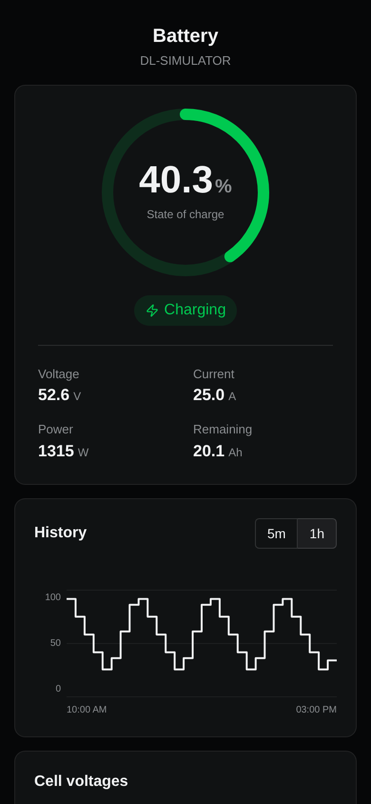
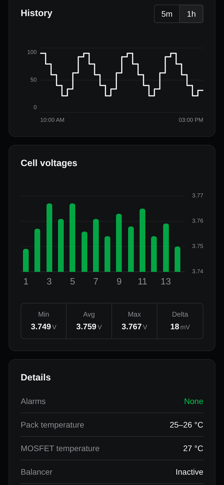

# golfcart

Live telemetry and history for a golf cart's battery. A Raspberry Pi parked next to the cart reads the BMS over Bluetooth LE, keeps every reading, and serves a dashboard.

<p align="center">
  
  
</p>

## Why

A lithium pack is a chemical system you can't see into. The observables that matter - per-cell voltage, current, temperature, state of charge - are already measured, every second, by the Daly BMS bolted to the pack. But Daly locks them inside a phone app: no history, no API, no answer to "did it charge last night" unless you walk over with your phone.

The data exists. This repo liberates it and writes it down.

## How it works

```
Daly BMS --BLE--> Raspberry Pi --> SQLite --> REST --> dashboard
(registers)      (decode + store)                      (charts)
```

The pack is 14 NMC cells in series, 50 Ah, ~57 V. The BMS speaks a Modbus-style protocol over the BLE `fff0` UART service: write a CRC16-framed register request, collect the notification fragments, verify the CRC. Everything is registers - cell voltages in mV, current as `(reg - 30000) / 10` amps, temperatures offset by -40 degrees, alarms as a 64-bit bitmask. `packages/api/src/api/readings/bms.py` does the framing, `decode.py` turns registers back into physics. Raw frames are stored alongside decoded values, so decoding bugs are fixable retroactively.

The Pi holds one persistent BLE connection and polls every 60 seconds. There is no "is the cart home" sensor - none is needed. The cart is only in radio range when it is parked by the charger, so reconnect-with-backoff is the presence detector: connected means home, unreachable means someone is driving. At night the connection is dropped for a quiet-hours window so the BMS is not held open around the clock.

On top of that: FastAPI + SQLite, a TypeScript client generated from the OpenAPI spec (`make clients`), and a Vite/TanStack dashboard with a SOC gauge, per-cell voltages, alarms, and bucketed SOC history.

## Run it

```sh
cd packages/api && uv sync && uv run task db_migrate && uv run task api   # API on :8100
cd packages/web && pnpm install && pnpm dev                              # web on :3001
```

No golf cart? Set `bessel_BMS_SIMULATOR=1` before starting the API. A simulated pack drains from 100% to 20% and charges back up on a one-hour loop, emitting the same CRC-valid register frames as the real BMS - the entire decode/store/chart pipeline runs unchanged, including the low-SOC alarm and end-of-charge balancing.

Deploys with `make deploy`: pushes, then pulls + migrates + restarts the systemd service on the Pi over Tailscale.
